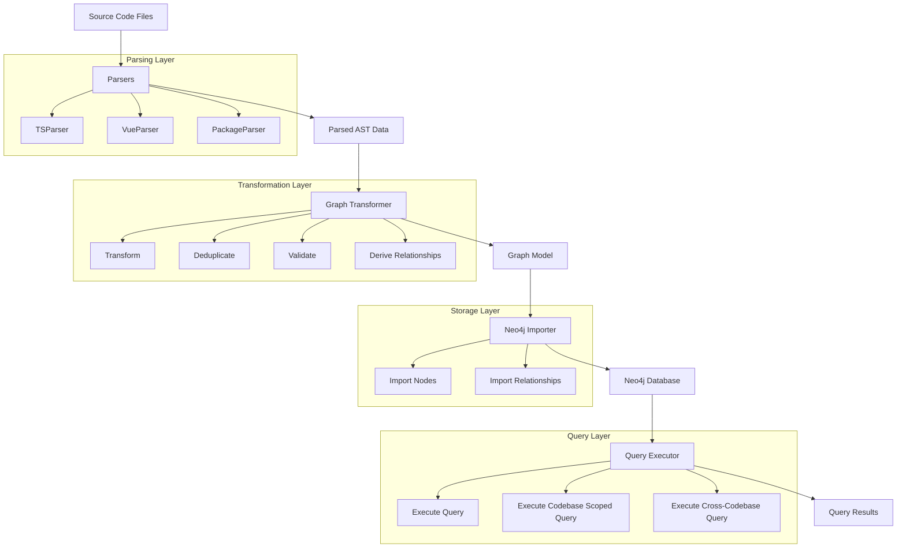

# TypeScript Code Graph

A tool for analyzing TypeScript/JavaScript codebases and representing them as a graph in Neo4j.

## Overview

This tool parses TypeScript and Vue code, transforms it into a graph model, and stores it in a Neo4j database for analysis. It enables powerful code structure analysis, dependency tracking, and cross-codebase relationship discovery.

## Installation

The tool is installed globally as `sage`:

```bash
# Install globally
npm install -g @sage/cli

# Verify installation
sage --version
```

Requirements:
- Node.js >= 16.0.0
- Neo4j database (local or remote)

## Data Flow Architecture

Below is a detailed analysis of how data flows through the system:

### Overall Data Flow Architecture



### Detailed Data Flow Process

#### 1. Code Parsing Phase

The system begins with source code files that are processed by specialized parsers:

- **TSParser**: Parses TypeScript/JavaScript files
  - `initialize()`: Sets up the TypeScript compiler
  - `parseFile()`: Processes a single file
  - `visitNode()`: Recursively visits AST nodes
  - Extraction methods (`extractClass()`, `extractInterface()`, etc.): Extract specific code elements

- **VueParser**: Parses Vue Single File Components
  - Handles template, script, and style sections
  - Extracts Vue-specific constructs (components, props, etc.)

- **PackageParser**: Parses package.json files
  - Extracts dependencies and project metadata

**Data Output**: Structured AST (Abstract Syntax Tree) representations of code elements

#### 2. Transformation Phase

The `GraphTransformer` class transforms parsed AST data into a graph model:

- `transform()`: Main entry point that orchestrates the transformation
- `deduplicateNodes()`: Removes duplicate node entries
- `deduplicateRelationships()`: Removes duplicate relationship entries
- `validate()`: Ensures data integrity
- `ensureNodeLabels()`: Adds appropriate labels to nodes
- `deriveAdditionalRelationships()`: Infers implicit relationships

**Data Output**: A clean, validated graph model with nodes and relationships

#### 3. Import Phase

The `Neo4jImporter` class imports the graph model into Neo4j:

- `import()`: Main entry point for the import process
- `importNodes()`: Imports all nodes in batches
- `importRelationships()`: Imports all relationships in batches
- `prepareNodeForImport()`: Transforms node data for Neo4j compatibility
- `prepareRelationshipForImport()`: Transforms relationship data for Neo4j compatibility
- `convertComplexPropertiesToPrimitives()`: Handles complex data types

**Data Output**: Populated Neo4j database with code structure

#### 4. Query Phase

The `QueryExecutor` class executes queries against the Neo4j database:

- `executeQuery()`: Runs a raw Cypher query
- `executeCodebaseScopedQuery()`: Runs a query scoped to a specific codebase
- `executeCrossCodebaseQuery()`: Runs a query across multiple codebases

**Data Output**: Query results that can be used for analysis

### Orchestration

The `TSCodeGraph` class orchestrates the entire process:

- Properties:
  - `tsParser`: TypeScript parser
  - `vueParser`: Vue parser
  - `packageParser`: Package parser
  - `transformer`: Graph transformer
  - `queryExecutor`: Query executor

- Key Methods:
  - `process()`: Main entry point that orchestrates the entire pipeline
  - `findSourceFiles()`: Locates source files to process
  - `importToNeo4j()`: Handles the Neo4j import process
  - Various query methods for different analysis needs

### Data Transformation Examples

1. **TypeScript Class → Neo4j Nodes and Relationships**:
   - A TypeScript class is parsed into a Class node
   - Its methods become Method nodes with HAS_METHOD relationships
   - Its properties become Property nodes with HAS_PROPERTY relationships
   - Inheritance becomes EXTENDS relationships

2. **Import Statement → Neo4j Relationships**:
   - An import statement creates IMPORTS relationships between files
   - Named imports create REFERENCES relationships to specific elements

3. **Function Calls → Neo4j Relationships**:
   - Function calls create CALLS relationships between functions
   - Parameters create HAS_PARAMETER relationships

## Usage

### Ingesting a Codebase

To analyze a new codebase:

```bash
# Ingest a specific project
sage ingest --path /path/to/project --codebase-id my-project

# Ingest the current directory as 'self'
sage ingest self

# Or using the example script
sage example /path/to/project
```

### Querying the Graph Database

Once a codebase is ingested, you can query it using Cypher:

```bash
# Using the CLI
sage query "MATCH (c:Class {codebaseId: 'my-project'}) RETURN c.name, c.filePath"
```

### Cross-Codebase Analysis

The tool supports analyzing relationships between different codebases:

```bash
# Find relationships between codebases
sage query "MATCH (a)-[r]->(b) WHERE a.codebaseId = 'ui' AND b.codebaseId = 'self' RETURN type(r), count(r)"
```

## Analysis Capabilities

With this system, you can:

1. **Trace Code Dependencies**:
   - Follow IMPORTS and CALLS relationships to understand dependencies
   - Query for all dependencies of a specific file or function

2. **Analyze Code Structure**:
   - Query for class hierarchies using EXTENDS relationships
   - Find all implementations of an interface

3. **Identify Cross-Codebase Relationships**:
   - Discover how different codebases interact with each other
   - Find shared dependencies between projects

4. **Perform Impact Analysis**:
   - Determine what would be affected by changing a specific component
   - Trace all usages of a particular function or class