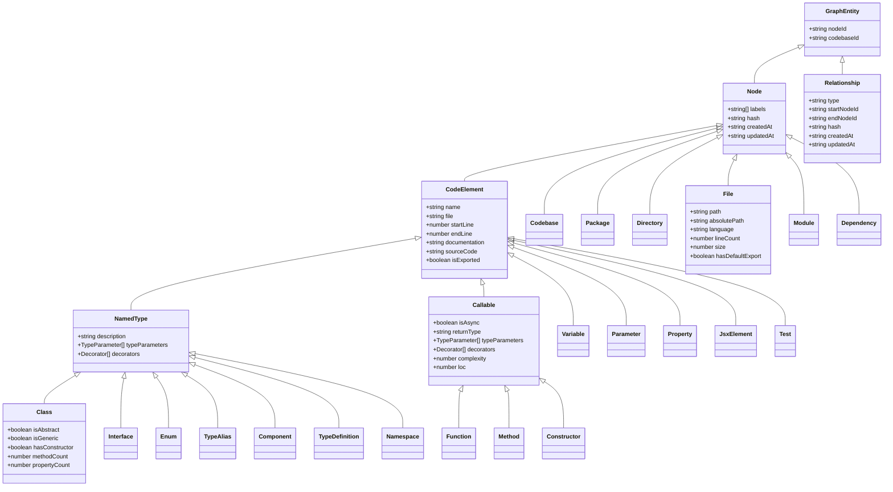
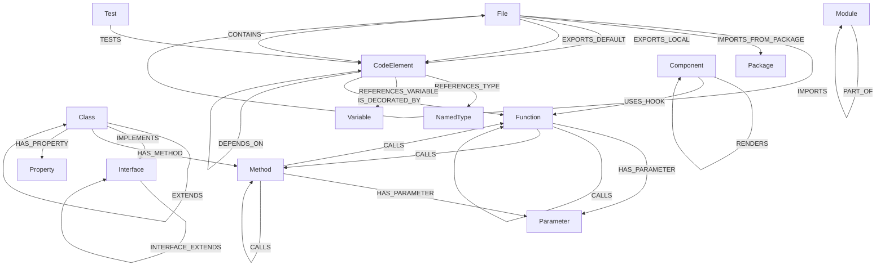
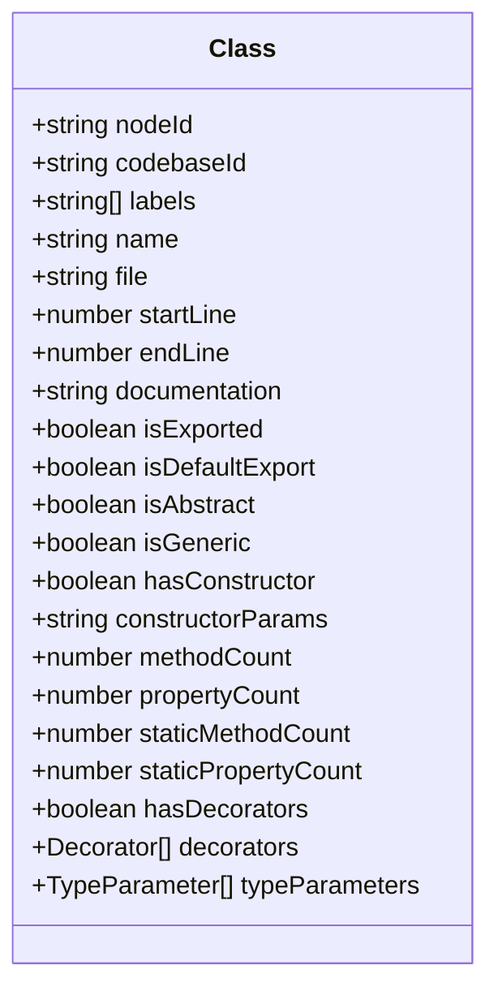
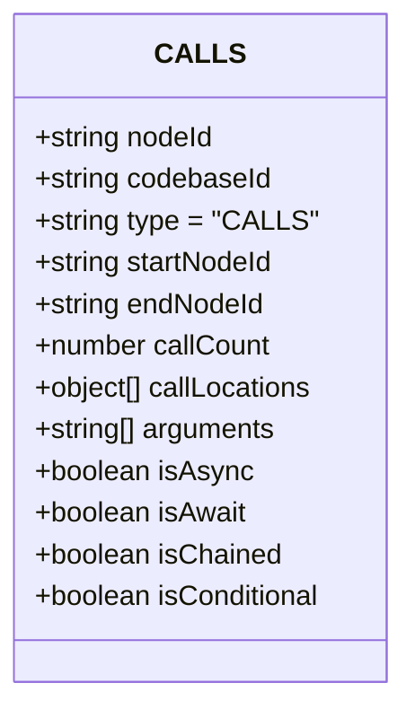
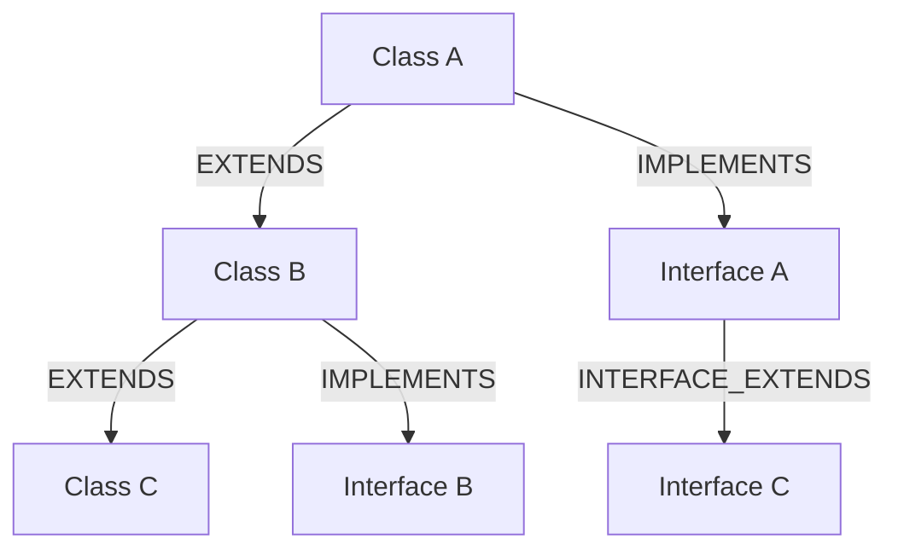
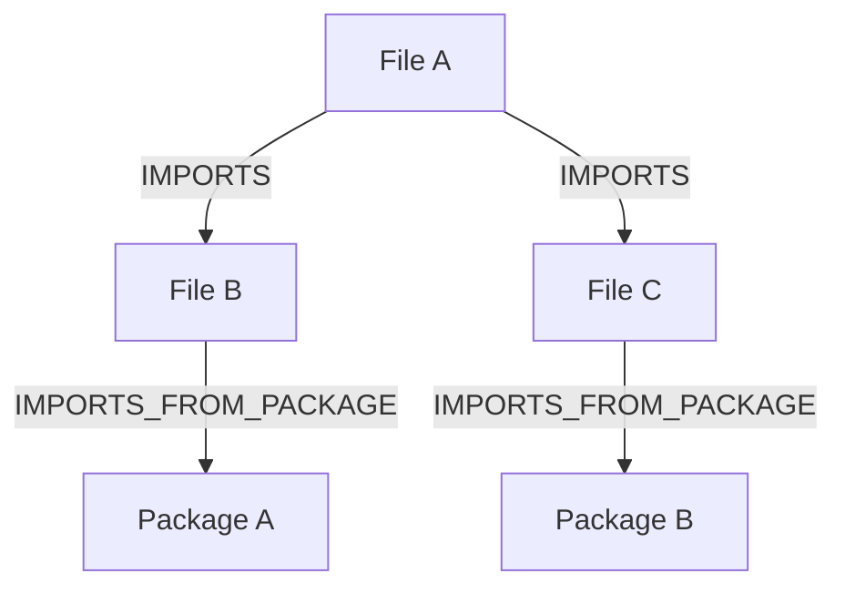
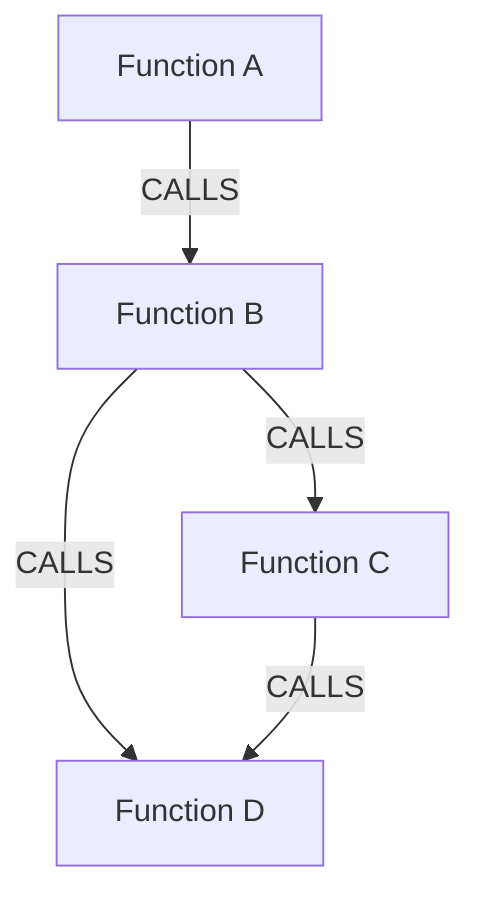
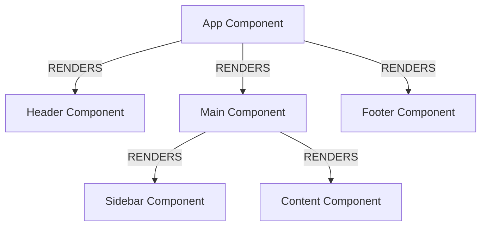

# TypeScript Code Graph Schema Visualization

This document provides a visual representation of the TypeScript Code Graph schema using Mermaid diagrams.

## Node Types Hierarchy



## Key Relationships



## Detailed Node Type: Class



## Detailed Relationship Type: CALLS



## Common Graph Patterns

### Class Hierarchy



### Module Dependencies



### Function Call Graph



### Component Hierarchy



## Neo4j Cypher Query Examples

### Find all callers of a function

```cypher
MATCH (caller)-[:CALLS]->(callee:Function {name: 'targetFunction'})
RETURN caller
```

### Find all dependencies of a file

```cypher
MATCH (file:File {path: 'src/index.ts'})-[:IMPORTS*]->(dep:File)
RETURN dep
```

### Find potential circular dependencies

```cypher
MATCH path = (a:File)-[:IMPORTS*]->(b:File)-[:IMPORTS*]->(a)
RETURN path
```

### Find unused exports

```cypher
MATCH (file:File)-[:EXPORTS_LOCAL|EXPORTS_DEFAULT]->(export)
WHERE NOT EXISTS((export)<-[:IMPORTS]-())
RETURN export
```

### Find complex classes (too many methods)

```cypher
MATCH (class:Class)-[:HAS_METHOD]->(method:Method)
WITH class, COUNT(method) as methodCount
WHERE methodCount > 10
RETURN class, methodCount
ORDER BY methodCount DESC
```

### Find the impact of changing a code element

```cypher
MATCH (element {nodeId: 'element-id'})
OPTIONAL MATCH (dependent)-[:CALLS|REFERENCES_VARIABLE|REFERENCES_TYPE|EXTENDS|IMPLEMENTS|IMPORTS|DEPENDS_ON]->(element)
RETURN dependent
```

### Find type hierarchies

```cypher
MATCH path = (type:Class|Interface)-[:EXTENDS|IMPLEMENTS*0..10]->(baseType)
WHERE type.name = 'MyClass'
RETURN path